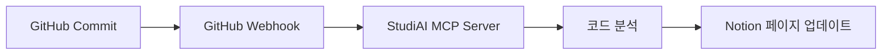

<h1 align="center">StudiAI - MCP 기반 코드 분석 & 문서 자동화 서버</h1> <p align="center"> 📚 AI 모델을 위한 프로젝트 기획 & 코드 문서화 MCP 서버 Claude Desktop 호환 / GitHub & Notion 통합 자동화 지원 </p>
🗂️ About
StudiAI MCP Server는 Model Context Protocol(MCP) 기반으로 구축된
프로젝트 기획 / 코드 분석 / 문서 자동화 지원 서버입니다.

AI 모델(예: Claude, Cursor 등)과 연동하여 다음과 같은 기능을 제공합니다:

GitHub 저장소 변경 내역 자동 분석 & 문서화

Notion DB 기반 프로젝트/학습 관리

AI 기반 코드 분석 → 문서 생성 워크플로우 제공

프로젝트 진행상황을 AI/인간이 쉽게 공유하고 관리

📅 개발 기간: 2025.04.21 ~ 2025.06.16

🔍 주요 기능
🚀 Core MCP Tools
✅ GitHub Webhook 처리 → 커밋 단위 코드 분석

✅ Notion Webhook 처리 → 페이지 상태 변경 자동 업데이트

✅ 함수/클래스 분석 도구 → 상세 문서화 자동화

✅ 학습 지원 → AI 피드백 loop, 학습 진도 관리

⚙️ Automation Workflow
🔄 자동 문서화 → 기술 문서 자동 생성

📊 진행상황 추적 → 시각적 프로젝트 관리

🔗 GitHub ↔ Notion 양방향 연동

🛠️ Tech Stack
구성 요소	기술
MCP 서버	Python FastAPI
AI 연동	MCP 프로토콜, Claude Desktop 호환
데이터 관리	GitHub API, Notion API
DB 연동	Supabase(PostgreSQL), Redis (Cache)
비동기 워커	Redis + RQ
테스트	pytest
배포 방식	Docker 기반 서버 배포

📁 Project Structure
```
StudiAI-MCP-Server/
├── app/
│ ├── api/ # API 엔드포인트
│ ├── core/ # 공통 유틸 / 설정
│ ├── mcp_tools/ # MCP Tools 구현
│ ├── notion_integration/ # Notion 연동
│ ├── github_integration/ # GitHub 연동
│ ├── supa/ # Supabase 연동
│ ├── services/ # 서비스 로직
│ └── worker/ # 비동기 워커 (RQ)
├── tests/ # 테스트 코드
├── config/ # 설정 파일
├── docker/ # Docker 관련 파일
└── docs/ # 문서
```

🚀 Quick Start
1️⃣ MCP 서버 실행
```bash
docker-compose up --build
```

2️⃣ GitHub Webhook 설정
```text
https://your-server.com/github/webhook

이벤트 타입: push, pull_request
```

3️⃣ Notion Integration 설정
```text

Notion DB ID / API Key 설정
```

4️⃣ AI 모델 활용 예시
```text
"최근 커밋 분석해서 Notion 업데이트해줘"
"이번 주 학습 내용을 정리해줘"
"코드 변경 사항 문서화해줘"
```

💡 Example Workflow
GitHub → Notion 자동화


🎯 Use Cases
사용 사례	설명
개발 프로젝트 관리	커밋 단위 진행상황 자동 기록, 코드 리뷰 문서화
학습 과정 기록	실습 코드 분석, 학습 노트 자동 생성
팀 협업 지원	프로젝트 상태 공유, 일정 관리, 지식 베이스 구축

🌍 관련 MCP 서버 생태계
본 프로젝트는 Awesome MCP Servers에 등록된 MCP 표준 서버 패턴을 따르며,
Claude Desktop 및 MCP 호환 클라이언트와 원활히 작동합니다.

MCP 공식: Model Context Protocol
