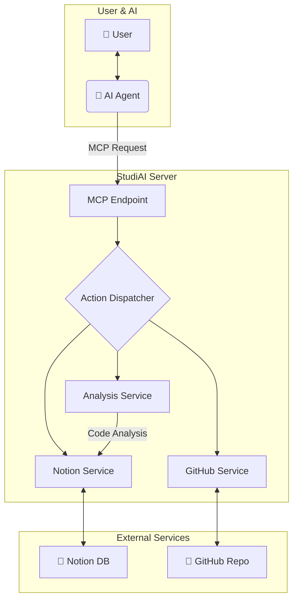

<h1 align="center">StudiAI - AI 에이전트 기반 프로젝트 자동화 서버</h1>

  <strong>"AI 에이전트와의 대화만으로, 당신의 프로젝트 기획부터 코드 관리, 문서화까지 모든 것을 자동화하세요."</strong>

  
  
  
  
  

---

## 🚀 About StudiAI

**StudiAI**는 개발자가 AI 에이전트(Claude, Cursor 등)와 상호작용하며 프로젝트를 진행하는 방식을 개선하는 Model Context Protocol(MCP) 서버입니다.

단순히 AI에게 질문하고 답변을 얻는 것을 넘어, **AI와의 대화 내용과 의도를 StudiAI가 파악하여 Notion DB에 프로젝트 기획, 일정, 작업 내역을 자동으로 기록하고, GitHub 커밋과 연동하여 코드 변경사항까지 관리**합니다.

프로젝트의 시작부터 끝까지, AI 에이전트가 당신의 든든한 프로젝트 매니저가 되어 드립니다.

## ✨ Key Features

### 🤖 AI 기반 워크플로우 자동화
- **대화형 프로젝트 생성**: AI 에이전트와 프로젝트에 대해 대화하면, StudiAI가 자동으로 Notion에 기획 문서를 생성하고 일정을 수립합니다.
- **GitHub 커밋 자동 분석**: GitHub 저장소에 코드를 Push하면, 연결된 Notion 작업 페이지에 커밋 내용과 코드 변경사항이 자동으로 요약 및 기록됩니다.
- **Notion DB 양방향 동기화**: Notion 페이지의 상태 변경(예: `In Progress` → `Done`)을 감지하여 관련 시스템에 업데이트를 트리거합니다.

### 📈 학습 및 개발 관리
- **학습 내용 자동 정리**: AI와 함께 학습한 내용이나 실습 코드를 Notion DB에 체계적으로 정리하여 자신만의 지식 베이스를 구축할 수 있습니다.
- **AI 코드 리뷰 및 피드백**: 커밋된 코드에 대한 AI의 분석 리포트를 Notion 페이지에서 바로 확인하고 피드백 루프를 만들 수 있습니다.

## ⚙️ How It Works

StudiAI는 사용자와 AI 에이전트, 그리고 외부 서비스(Notion, GitHub) 사이에서 중추적인 역할을 수행합니다.

## 🤖 AI 에이전트 활용 가이드 (MCP Tools)

StudiAI의 모든 기능은 AI 에이전트에게 특정 `Tool`을 사용하라고 지시하여 실행할 수 있습니다. StudiAI를 처음 사용하신다면, 아래 가이드를 따라 AI 에이전트와 함께 초기 설정을 진행해주세요.

---

### **🚀 1단계: 초기 설정 (최초 1회)**
가장 먼저, StudiAI가 당신의 Notion 계정에 접근하고 작업할 수 있도록 워크스페이스와 기본 페이지를 지정해야 합니다. 이 과정은 최초 한 번만 수행하면 됩니다.

1.  **워크스페이스 연결 및 활성화**
    *   **명령**: `"내 노션 워크스페이스 목록을 보여줘."`
    *   **AI 작업**: `notion_settings_tool`의 `workspaces` 액션을 호출하여 연결 가능한 워크스페이스 목록을 확인합니다.
    *   **명령**: `"'<워크스페이스 이름>' 워크스페이스를 활성화해줘."`
    *   **AI 작업**: `set_active_workspace` 액션으로 StudiAI가 작업할 기본 워크스페이스를 선택합니다.

2.  **최상위 페이지(루트) 지정**
    *   **명령**: `"최상위 페이지로 설정할 수 있는 페이지 목록을 보여줘."`
    *   **AI 작업**: `notion_settings_tool`의 `top_pages` 액션을 호출하여 루트로 지정할 페이지 후보를 확인합니다.
    *   **명령**: `"'<페이지 이름>' 페이지를 최상위 페이지로 설정해줘."`
    *   **AI 작업**: `set_top_page` 액션으로 모든 프로젝트와 학습 DB가 생성될 루트 페이지를 지정합니다. 이 페이지 하위에 모든 데이터가 정리됩니다.

---

### **🚀 2단계: 프로젝트/학습 DB 관리 (`database_tool`)**
초기 설정이 완료되면, 프로젝트나 학습 계획을 담을 Notion 데이터베이스를 생성하고 관리할 수 있습니다.

*   **주요 액션**: `list`, `current`, `create`, `activate`, `deactivate`
*   **사용 예시**:
    *   `"연결 가능한 노션 데이터베이스 목록을 보여줘."`
    *   `"새로운 학습 프로젝트를 위한 데이터베이스를 만들어줘. 이름은 '알고리즘 스터디'로 해줘."`
    *   `"'알고리즘 스터디' 데이터베이스를 현재 활성 프로젝트로 설정해줘."`

---

### **🚀 3단계: 페이지 관리 (`page_tool`)**
활성화된 데이터베이스 내의 페이지(작업, 학습 노트 등)를 생성하고 관리합니다.

*   **주요 액션**: `list`, `create`, `update`, `get`
*   **사용 예시**:
    *   `"현재 프로젝트에 '백준 1001번 문제 풀이'라는 이름으로 새 페이지를 만들어줘."`
    *   `"'백준 1001번' 페이지에 '오늘 문제 풀이 완료'라고 내용을 추가해줘."`
    *   `"현재 프로젝트의 모든 페이지 목록을 보여줘."`

---

### **🚀 4단계: GitHub 연동 (`github_webhook_tool`)**
GitHub 저장소와 Notion을 연결하여 코드 변경 내역을 자동으로 추적합니다.

*   **주요 액션**: `repos`, `create`
*   **사용 예시**:
    *   `"내 GitHub 계정에 있는 리포지토리 목록을 가져와줘."`
    *   `"'my-project' 리포지토리를 현재 노션 프로젝트와 연결해줘. 이제부터 커밋하면 자동으로 기록해줘."`

---

### **💡 도움이 필요할 때 (`helper`, `user_guide`)**
각 도구의 상세한 사용법이 궁금할 때 사용합니다.

*   **사용 예시**:
    *   `"database_tool의 create 액션은 어떻게 사용해? 예시를 보여줘."` (→ `helper` 호출)
    *   `"페이지 관리에 대한 전체적인 사용자 가이드를 보여줘."` (→ `user_guide` 호출)
