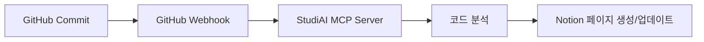

<h1 align="center">StudiAI MCP Server<h1>
## 프로젝트 기획 & 문서 자동화를 위한 MCP 도구

**📅 개발 기간:** 2025.04.21 ~ 2025.06.16

---

## ✨ 프로젝트 소개

`StudiAI`는 **Model Context Protocol(MCP) 서버**로 구현된 **프로젝트 기획 및 문서 자동화 지원 도구**입니다.

Claude 등의 AI 모델이 다음 기능을 활용할 수 있도록 MCP Tools를 제공합니다:

- 🎯 **프로젝트 기획 관리** - Notion DB 연동을 통한 체계적 기획 관리
- 🔄 **GitHub 커밋 자동 분석** - 코드 변경사항 실시간 분석 및 문서화
- 📝 **Notion 페이지 자동 관리** - 학습/프로젝트 진행상황 자동 기록
- 🛠️ **학습 보조 기능** - MCP Tools를 통한 다양한 학습 지원

---

## 🔍 주요 기능

### Core MCP Tools
- ✅ **GitHub Webhook 처리** - 커밋 단위 코드 분석 및 Notion 자동 기록
- ✅ **Notion Webhook 연동** - 페이지 상태 변경 실시간 감지 및 업데이트
- ✅ **코드 분석 도구** - 함수/클래스 단위 상세 분석 및 문서 자동 생성
- ✅ **학습 지원 도구** - Feedback Tool, Progress Tracker 등

### Automation Workflow
- 🔄 **자동 문서화** - 코드 변경사항을 분석하여 기술 문서 자동 생성
- 📊 **진행상황 추적** - 프로젝트/학습 진도를 Notion DB에서 시각적 관리
- 🔗 **통합 연동** - GitHub ↔ Notion 양방향 데이터 동기화

---

## 🚀 사용 방법

### 1. MCP 서버 설정
Claude Desktop 또는 다른 MCP 클라이언트에서 StudiAI MCP 서버를 연결합니다.

### 2. GitHub 저장소 연동
```bash
# Webhook URL 설정
https://your-server.com/github/webhook

# 이벤트 타입: push, pull_request
```

### 3. Notion 워크스페이스 연동
```bash
# Notion Integration 설정
# Database ID 및 API Key 구성
```

### 4. AI 모델에서 활용
Claude와 대화하며 다음과 같은 작업을 요청할 수 있습니다:
- "최근 커밋 분석해서 프로젝트 진행상황 업데이트해줘"
- "이번 주 학습 내용을 정리해서 Notion에 기록해줘"
- "코드 변경사항을 분석해서 기술 문서 작성해줘"

---

## 📄 워크플로우 예시

### GitHub → Notion 자동화


### AI 모델과의 상호작용
```text
사용자: "오늘 작업한 코드 분석해서 학습 일지에 정리해줘"
  ↓
Claude: StudiAI MCP Tools 활용
  ↓ 
GitHub API → 최근 커밋 분석 → Notion 학습 DB 업데이트
```

---

## 🛠️ 기술 스택

**MCP Server Framework**
- Python FastAPI
- MCP Protocol Implementation

**연동 서비스**
- GitHub API & Webhooks
- Notion API
- Database Management

**AI Integration**
- Model Context Protocol (MCP)
- Claude Desktop 호환

---

## 📁 프로젝트 구조

```
StudiAI-MCP-Server/
├── src/
│   ├── mcp_tools/          # MCP Tools 구현
│   ├── github_integration/ # GitHub 연동 로직
│   ├── notion_manager/     # Notion API 관리
│   └── webhooks/          # Webhook 처리
├── config/                # 설정 파일
└── docs/                 # 문서화
```

---

## 🎯 활용 사례

1. **개발 프로젝트 관리**
   - 커밋마다 자동으로 진행상황 기록
   - 코드 리뷰 내용 문서화
   - 기술적 의사결정 과정 추적

2. **학습 과정 기록**
   - 실습 코드 분석 및 학습 노트 자동 생성
   - 진도 관리 및 복습 스케줄링
   - 학습 성과 시각화

3. **팀 협업 지원**
   - 프로젝트 상태 실시간 공유
   - 작업 분담 및 일정 관리
   - 지식 베이스 구축

---

## 📝 라이선스

MIT License

---

## 🤝 기여하기

Issues와 Pull Requests를 환영합니다!

1. Fork the Project
2. Create your Feature Branch
3. Commit your Changes
4. Push to the Branch
5. Open a Pull Request
