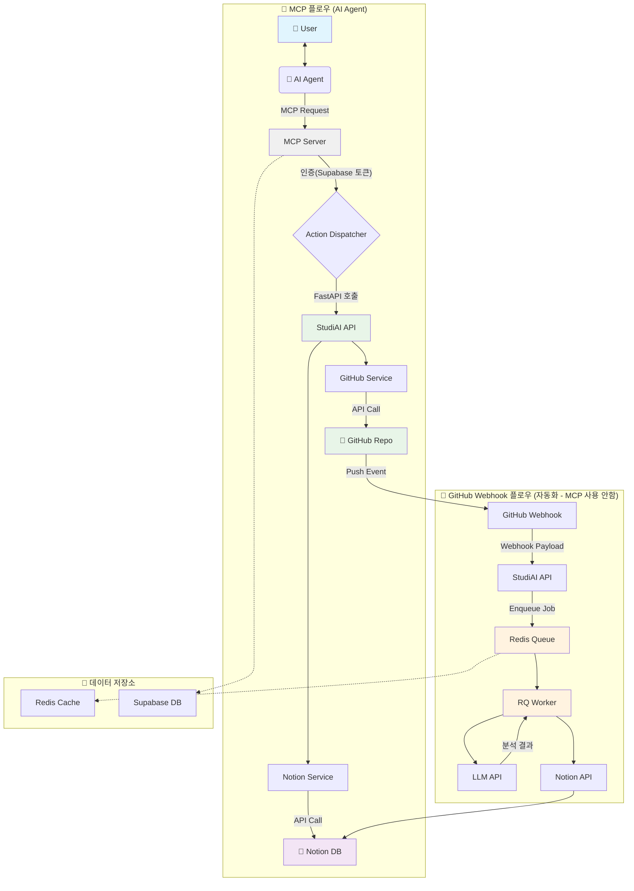

<h1 align="center">StudiAI - AI 에이전트 기반 프로젝트 자동화 서버</h1>

  <strong>"AI 에이전트와의 대화만으로, 당신의 프로젝트 기획부터 코드 관리, 문서화까지 모든 것을 자동화하세요."</strong>

  
  
  
  
  

---

## 📋 목차

- [About StudiAI](#-about-studiai)
- [Key Features](#-key-features)
- [How It Works](#️-how-it-works)
- [MCP란?](#-mcp란-무엇인가)
- [기술 스택](#️-기술-스택)
- [StudiAI 시작하기](#-studiai-시작하기---ai와-함께하는-자연스러운-프로젝트-관리)
- [프로젝트 상태](#-프로젝트-상태)
- [자주 묻는 질문](#-자주-묻는-질문)
- [제한사항](#️-제한사항)
- [문의](#-문의)

---

## 🚀 About StudiAI

**StudiAI**는 개발자가 AI 에이전트(Claude, Cursor 등)와 상호작용하며 프로젝트를 진행하는 방식을 개선하는 Model Context Protocol(MCP) 서버입니다.

단순히 AI에게 질문하고 답변을 얻는 것을 넘어, **AI와의 대화 내용과 의도를 StudiAI가 파악하여 Notion DB에 프로젝트 기획, 일정, 작업 내역을 자동으로 기록하고, GitHub 커밋과 연동하여 코드 변경사항까지 관리**합니다.

프로젝트의 시작부터 끝까지, AI 에이전트가 당신의 든든한 프로젝트 매니저가 되어 드립니다.

## ✨ Key Features

### 🤖 AI 기반 워크플로우 자동화
- **대화형 프로젝트 생성**: AI 에이전트와 프로젝트에 대해 대화하면, StudiAI가 자동으로 Notion에 기획 문서를 생성하고 일정을 수립합니다.
- **GitHub 커밋 자동 분석**: GitHub 저장소에 코드를 Push하면, 연결된 Notion 작업 페이지에 커밋 내용과 코드 변경사항이 자동으로 요약 및 기록됩니다.
- **Notion DB 양방향 동기화**: Notion 페이지의 상태 변경(예: `In Progress` → `Done`)을 감지하여 관련 시스템에 업데이트를 트리거합니다.

### 📈 학습 및 개발 관리
- **학습 내용 자동 정리**: AI와 함께 학습한 내용이나 실습 코드를 Notion DB에 체계적으로 정리하여 자신만의 지식 베이스를 구축할 수 있습니다.
- **AI 코드 리뷰 및 피드백**: 커밋된 코드에 대한 AI의 분석 리포트를 Notion 페이지에서 바로 확인하고 피드백 루프를 만들 수 있습니다.

## ⚙️ How It Works

StudiAI는 사용자와 AI 에이전트, 그리고 외부 서비스(Notion, GitHub) 사이에서 중추적인 역할을 수행합니다.

## 🔗 MCP란?

**Model Context Protocol (MCP)** 는 AI 모델이 외부 서비스와 안전하게 소통할 수 있도록 하는 표준 프로토콜입니다. 

StudiAI는 MCP 서버로서 Claude, Cursor 같은 AI 에이전트들이 Notion, GitHub 등의 서비스에 접근할 수 있는 도구들을 제공합니다. 사용자는 AI와 자연스럽게 대화하기만 하면, AI가 MCP를 통해 StudiAI의 기능들을 호출하여 실제 작업을 수행합니다.

**간단히 말해**: AI ↔ MCP ↔ StudiAI ↔ Notion/GitHub 이런 구조로 연결됩니다.

---

## 🛠️ 기술 스택

### **Backend**
- **FastAPI + Python 3.13** - API 서버
- **Model Context Protocol (MCP)** - AI 에이전트 통신 프로토콜

### **Database**
- **Supabase (PostgreSQL)** - 메인 데이터베이스
- **Redis** - 캐시 및 작업 큐

### **Background Jobs**
- **RQ (Redis Queue)** - 웹훅 이벤트 처리
- **RQ Worker** - 별도 프로세스로 실행되는 백그라운드 작업 처리기
- **asyncio** - 비동기 작업

### **Integrations**
- **Notion API** - 워크스페이스/데이터베이스 관리
- **GitHub API** - 리포지토리 연동
- **OpenAI API** - GPT 4o-mini 모델을 통한 함수별 코드분석
- **OAuth 2.0** - 사용자 인증

### **Infrastructure**
- **Docker** - 컨테이너화 (MCP 서버, FastAPI, RQ 서버 분리)
- **Railway** - 클라우드 호스팅 플랫폼

---

## 🚀 StudiAI 시작하기 - AI와 함께하는 자연스러운 프로젝트 관리

StudiAI는 **자연스러운 대화**만으로 모든 기능을 사용할 수 있습니다. AI 에이전트(Claude, Cursor 등)와 평소처럼 대화하면, AI가 알아서 적절한 작업을 수행해줍니다.

---

## 📋 **시작 전 준비사항**

### **1️⃣ Claude Desktop MCP 등록 (필수)**
StudiAI는 원격 MCP 서버로 동작하므로 Claude Desktop에 등록이 필요합니다.

> **중요**: 현재 **Claude Desktop만 지원됩니다.** Cursor는 아직 원격 MCP를 지원하지 않습니다.

**등록 방법:**
1. Claude Desktop의 **설정 > 통합**으로 이동
2. "커스텀 통합 추가" 클릭  
3. StudiAI 서버 URL 입력
4. 통합 추가 완료

> **요구사항**: Claude Pro, Max, Team, Enterprise 플랜 필요 ([자세한 등록 방법](https://support.anthropic.com/ko/articles/11175166-%EC%9B%90%EA%B2%A9-mcp%EB%A5%BC-%EC%82%AC%EC%9A%A9%ED%95%9C-%EC%82%AC%EC%9A%A9%EC%9E%90-%EC%A0%95%EC%9D%98-%ED%86%B5%ED%95%A9%EC%97%90-%EB%8C%80%ED%95%98%EC%97%AC))

### **2️⃣ Notion 계정 연동 (필수)**
StudiAI 사용을 위해서는 먼저 Notion 계정 연동이 필요합니다. AI에게 "Notion 연동"을 요청하면 OAuth 인증 링크를 제공하며, 브라우저에서 Notion 로그인을 완료하면 자동으로 계정이 연결됩니다.

> **참고**: 계정 연동 없이는 어떤 기능도 사용할 수 없습니다.

---

## 🎯 **초기 설정 (최초 1회)**

### **3️⃣ 워크스페이스와 최상위 페이지 설정**
계정 연동 후에는 사용할 워크스페이스를 선택하고, 모든 프로젝트 DB가 생성될 최상위 페이지를 지정해야 합니다. AI가 워크스페이스 목록을 보여주면 원하는 것을 선택하고, 마찬가지로 최상위 페이지도 설정하면 됩니다.

**수행 과정**: 워크스페이스 활성화 → 최상위 페이지 지정 → 향후 관리할 모든 프로젝트 DB가 이 페이지 하위에 생성

---

## 📂 **일상적인 프로젝트 관리**

### **4️⃣ 새 프로젝트 시작하기**
AI에게 새 프로젝트를 시작한다고 말하면 자동으로 Notion 데이터베이스를 생성해줍니다. 프로젝트 이름을 지정하면 해당 이름으로 DB가 만들어지고 활성화됩니다.

> Claude Desktop에서 "새 Flask 프로젝트 만들어줘"라고 하면 자동으로 Notion DB가 생성됩니다.

> **참고**: 프로젝트/학습 기획을 모두 마친 이후에 DB를 생성하는 것을 권장합니다. 명확한 계획이 있을 때 더 체계적인 관리가 가능합니다. 

### **5️⃣ 작업 관리하기**
일상적인 작업은 자연스럽게 요청하면 됩니다. "오늘 할 일"을 말하면 페이지가 생성되고, 작업 완료 시 "완료했다"고 말하면 상태가 업데이트됩니다.

---

## 🔗 **GitHub 자동화 설정**

### **6️⃣ GitHub 계정 연동**
GitHub 자동화를 위해서는 GitHub 계정 연동이 필요합니다. Notion 연동과 마찬가지로 OAuth 인증을 통해 진행됩니다.

### **7️⃣ 프로젝트와 리포지토리 연결**
GitHub 계정 연동 후 프로젝트와 리포지토리 연결을 요청하면, AI가 리포지토리 목록을 보여주고 선택한 저장소에 웹훅을 설정합니다.

**자동화 흐름**: Git Push → GitHub Webhook → StudiAI 자동 분석 → Notion 페이지 업데이트

---

## **설정 완료 후 활용**

설정이 완료되면 다음과 같은 방식으로 활용할 수 있습니다:
- **프로젝트 계획**: 할 일 목록 정리 및 일정 관리
- **진행 상황 추적**: 현재 프로젝트 상태 확인
- **코드 분석**: GitHub 커밋 시 자동으로 코드 분석 결과가 Notion에 저장
- **학습 관리**: 학습 내용 정리 및 체계적 기록

**핵심**: 복잡한 명령어나 도구 이름을 기억할 필요 없이, 자연스러운 대화만으로 모든 프로젝트 관리가 가능합니다.

### **🎬 자동화 시연 예시**

**GitHub 커밋 시 자동 분석 결과:**

**커밋 전:**

**커밋 후:**

> 코드를 커밋하면 자동으로 함수별 분석 결과가 Notion 페이지에 추가됩니다.

---

## 📍 프로젝트 상태

현재 **베타 버전**으로 개인적으로 개발하고 있습니다.
- 초대받은 사용자만 이용 가능 (API 사용 비용이 발생하여 사용 제한)
- 일부 기능이 불안정할 수 있음  
- 개인 프로젝트라 업데이트가 불규칙할 수 있음
- 피드백은 언제든 환영합니다 

---

## 🗺️ 향후 계획

개인 프로젝트지만 기능을 개선해나갈 예정입니다.

### **단기 계획 (1-2개월)**
- [ ] MCP 도구 개선 및 안정화
- [ ] GitHub 웹훅 처리 성능 최적화
- [ ] 코드 분석 품질 향상 (더 정확한 AI 분석)

### **중기 계획 (3-6개월)**
- [ ] PARA 노트법 적용 (Projects-Areas-Resources-Archive 구조)
- [ ] 알림 연동 (Slack, Discord 등)
- [ ] 사용자 가이드 및 문서화 보강

### **장기 계획 (미정)**
- [ ] 여러 플랫폼 지원 (Obsidian 등 Notion 외 다른 플랫폼)
- [ ] 팀 협업 기능
- [ ] MCP 서버 확장 기능들

> **참고**: 개인 프로젝트 특성상 일정은 유동적이며, 사용자 피드백에 따라 우선순위가 변경될 수 있습니다.

---

## ❓ 자주 묻는 질문

**Q: OAuth 인증이 계속 실패해요**  
A: 브라우저 팝업 차단을 해제하고 다시 시도해보세요. 그래도 안 되면 시크릿 모드에서 시도해보세요.

**Q: GitHub 커밋했는데 Notion에 반영이 안 돼요**  
A: 웹훅을 받으면 커밋된 파일들을 하나씩 분석합니다. 파일 하나당 1~5분 소요되고 파일 크기에 따라 변동이 있습니다. 10분 이상 지속되면 웹훅 설정에 문제가 있을 수 있습니다.

**Q: 여러 프로젝트를 동시에 관리할 수 있나요?**  
A: 가능합니다. 기본적으로 활성 DB(DB 하나가 프로젝트 하나를 관리)를 메인으로 관리하고, GitHub 커밋 시에는 연동된 DB의 해당 작업 날짜에 맞는 페이지에 자동 연동되므로 여러 프로젝트 관리가 가능합니다.

**Q: 데이터가 날아갈 수도 있나요?**  
A: 기록은 Notion에 저장되므로 본인이 MCP로 삭제하거나 직접 삭제하지 않는 이상 데이터가 날아가지 않습니다. StudiAI 서버에 문제가 생겨도 Notion의 데이터는 그대로 유지됩니다.

---

## ⚠️ 제한사항

- **Notion API 제한**: 초당 3회 요청 제한 (Notion 정책)
- **GitHub 웹훅 처리**: 평균 2-5분 소요 (서버 사양 한계)
- **동시 활성 프로젝트**: 1개 권장 (여러 개 하면 헷갈림)
- **서버 운영**: Railway 무료 계정으로 운영 중이라 사용량이 많을 시 서비스 이용이 불가할 수 있음

---

## 📞 문의

- **버그 제보**: GitHub Issues 또는 직접 연락(e-mail : narosong@gmail.com)
- **기능 요청**: 직접 연락 바랍니다 
- **사용법 문의**: AI에게 "사용법 알려줘"라고 말하면 가이드를 제공합니다
