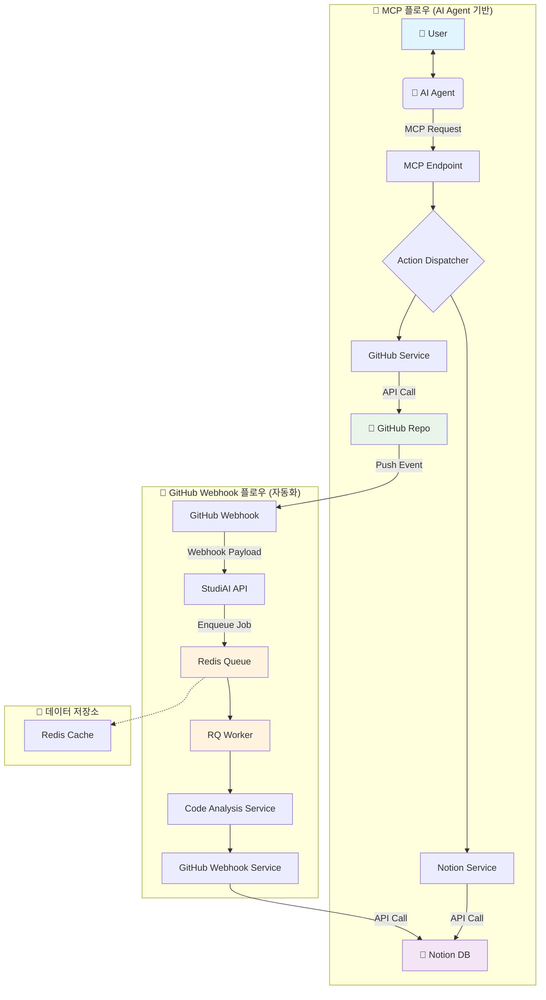

<h1 align="center">StudiAI - AI 에이전트 기반 프로젝트 자동화 서버</h1>

  <strong>"AI 에이전트와의 대화만으로, 당신의 프로젝트 기획부터 코드 관리, 문서화까지 모든 것을 자동화하세요."</strong>

  
  
  
  
  

---

## 🚀 About StudiAI

**StudiAI**는 개발자가 AI 에이전트(Claude, Cursor 등)와 상호작용하며 프로젝트를 진행하는 방식을 개선하는 Model Context Protocol(MCP) 서버입니다.

단순히 AI에게 질문하고 답변을 얻는 것을 넘어, **AI와의 대화 내용과 의도를 StudiAI가 파악하여 Notion DB에 프로젝트 기획, 일정, 작업 내역을 자동으로 기록하고, GitHub 커밋과 연동하여 코드 변경사항까지 관리**합니다.

프로젝트의 시작부터 끝까지, AI 에이전트가 당신의 든든한 프로젝트 매니저가 되어 드립니다.

## ✨ Key Features

### 🤖 AI 기반 워크플로우 자동화
- **대화형 프로젝트 생성**: AI 에이전트와 프로젝트에 대해 대화하면, StudiAI가 자동으로 Notion에 기획 문서를 생성하고 일정을 수립합니다.
- **GitHub 커밋 자동 분석**: GitHub 저장소에 코드를 Push하면, 연결된 Notion 작업 페이지에 커밋 내용과 코드 변경사항이 자동으로 요약 및 기록됩니다.
- **Notion DB 양방향 동기화**: Notion 페이지의 상태 변경(예: `In Progress` → `Done`)을 감지하여 관련 시스템에 업데이트를 트리거합니다.

### 📈 학습 및 개발 관리
- **학습 내용 자동 정리**: AI와 함께 학습한 내용이나 실습 코드를 Notion DB에 체계적으로 정리하여 자신만의 지식 베이스를 구축할 수 있습니다.
- **AI 코드 리뷰 및 피드백**: 커밋된 코드에 대한 AI의 분석 리포트를 Notion 페이지에서 바로 확인하고 피드백 루프를 만들 수 있습니다.

## ⚙️ How It Works

StudiAI는 사용자와 AI 에이전트, 그리고 외부 서비스(Notion, GitHub) 사이에서 중추적인 역할을 수행합니다.

## 🛠️ 기술 스택

StudiAI는 현대적이고 확장 가능한 기술 스택을 기반으로 구축되었습니다.

### **Backend & API**
- **FastAPI + Python 3.13** - 비동기 API서버
- **Model Context Protocol (MCP)** - AI 에이전트 통신 표준 프로토콜(Model Context Protocol)

### **데이터베이스 & 저장소**
- **Supabase (PostgreSQL)** - 실시간 데이터베이스 및 사용자 인증
- **Redis** - 캐싱 및 세션 관리

### **비동기 작업 처리**
- **RQ (Redis Queue)** - GitHub 웹훅 이벤트 백그라운드 처리
- **asyncio** - 비동기 HTTP 요청 및 병렬 처리

### **외부 API 연동**
- **Notion API** - 워크스페이스, 데이터베이스, 페이지 관리
- **GitHub API** - 리포지토리 정보 및 웹훅 설정
- **OAuth 2.0** - 안전한 사용자 인증 및 토큰 관리

---

## 🚀 StudiAI 시작하기 - AI와 함께하는 자연스러운 프로젝트 관리

StudiAI는 **자연스러운 대화**만으로 모든 기능을 사용할 수 있습니다. AI 에이전트(Claude, Cursor 등)와 평소처럼 대화하면, AI가 알아서 적절한 작업을 수행해줍니다.

---

## 📋 **시작 전 준비사항**

### **1️⃣ Notion 계정 연동 (필수)**
StudiAI 사용을 위해서는 먼저 Notion 계정 연동이 필요합니다. AI에게 "Notion 연동"을 요청하면 OAuth 인증 링크를 제공하며, 브라우저에서 Notion 로그인을 완료하면 자동으로 계정이 연결됩니다.

> **참고**: 계정 연동 없이는 어떤 기능도 사용할 수 없습니다.

---

## 🎯 **초기 설정 (최초 1회)**

### **2️⃣ 워크스페이스와 최상위 페이지 설정**
계정 연동 후에는 사용할 워크스페이스를 선택하고, 모든 프로젝트 DB가 생성될 최상위 페이지를 지정해야 합니다. AI가 워크스페이스 목록을 보여주면 원하는 것을 선택하고, 마찬가지로 최상위 페이지도 설정하면 됩니다.

**수행 과정**: 워크스페이스 활성화 → 최상위 페이지 지정 → 향후 관리할 모든 프로젝트 DB가 이 페이지 하위에 생성

---

## 📂 **일상적인 프로젝트 관리**

### **3️⃣ 새 프로젝트 시작하기**
AI에게 새 프로젝트를 시작한다고 말하면 자동으로 Notion 데이터베이스를 생성해줍니다. 프로젝트 이름을 지정하면 해당 이름으로 DB가 만들어지고 활성화됩니다.

> **참고**: 프로젝트/학습 기획을 모두 마친 이후에 DB를 생성하는 것을 권장합니다. 명확한 계획이 있을 때 더 체계적인 관리가 가능합니다. 

### **4️⃣ 작업 관리하기**
일상적인 작업은 자연스럽게 요청하면 됩니다. "오늘 할 일"을 말하면 페이지가 생성되고, 작업 완료 시 "완료했다"고 말하면 상태가 업데이트됩니다.

---

## 🔗 **GitHub 자동화 설정**

### **5️⃣ GitHub 계정 연동**
GitHub 자동화를 위해서는 GitHub 계정 연동이 필요합니다. Notion 연동과 마찬가지로 OAuth 인증을 통해 진행됩니다.

### **6️⃣ 프로젝트와 리포지토리 연결**
GitHub 계정 연동 후 프로젝트와 리포지토리 연결을 요청하면, AI가 리포지토리 목록을 보여주고 선택한 저장소에 웹훅을 설정합니다.

**자동화 흐름**: Git Push → GitHub Webhook → StudiAI 자동 분석 → Notion 페이지 업데이트

---

## **설정 완료 후 활용**

설정이 완료되면 다음과 같은 방식으로 활용할 수 있습니다:
- **프로젝트 계획**: 할 일 목록 정리 및 일정 관리
- **진행 상황 추적**: 현재 프로젝트 상태 확인
- **코드 분석**: GitHub 커밋 시 자동으로 코드 분석 결과가 Notion에 저장
- **학습 관리**: 학습 내용 정리 및 체계적 기록

**핵심**: 복잡한 명령어나 도구 이름을 기억할 필요 없이, 자연스러운 대화만으로 모든 프로젝트 관리가 가능합니다.
